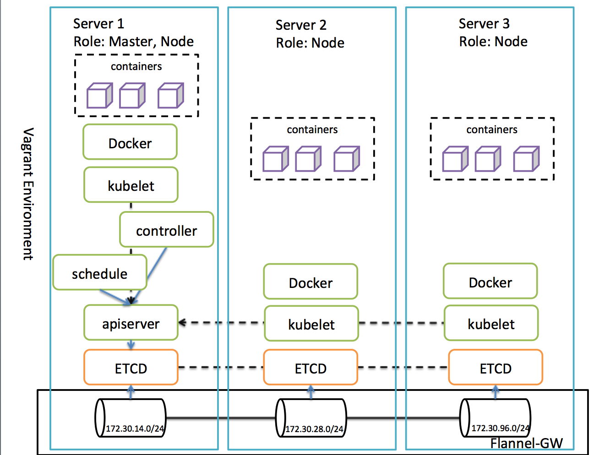

# Vagrant to setup kubernetes cluster
vagrant file to build a kubernets cluster which consists of 1 master and 3 nodes. You don't have to create complicated ca files and dont't have to do a lot of configuration

### Why don't do that with kubeadm

Because I want to setup the etcd, apiserver, controller, scheduler without docker container

### Architecutre




### Cluster network
The default setting will create the private network from 172.17.8.101 to 172.17.8.103 for nodes, and it will use the host's dhcp for the public ip

The kubenetes service's vip range is 10.254.0.0/16

The container network range is 170.30.0.0/30 owned by flanneld with GW mode

### Usage

#### Prerequisite
* Host server with 8G+ mem(More is better), 60G disk, 8 core cpu at lease
* vagrant 2.0+
* virtualbox 5.0+
* Maybe need to access the internet through GFW to download the kubernetes files

#### Support Addon

- CoreDNS
- Dashboard with service VIP

#### Need to modify Vagrantfile as need

You may need to change below line in Vagrantfile according to your host network

`node.vm.network "public_network", bridge: "en1: Wi-Fi (AirPort)", auto_config: false`

#### Setup
```
git clone https://github.com/duffqiu/centos-vagrant.git

cd centos-vagrant

vagrant up
```

#### Connect to kubernetes

```
vagrant ssh node1
sudo su
kubectl get nodes
```

#### Access dashboard without login

show the dashboard address

```
kubectl cluster-info
```

and then access dashboard via https

#### Rebuild the cluster

```
vagrant destroy
rm -rf .vagrant/
```

#### Note

Don't use it in production environment

#### Reference

* [Kubernetes Handbook](https://jimmysong.io/kubernetes-handbook/)

